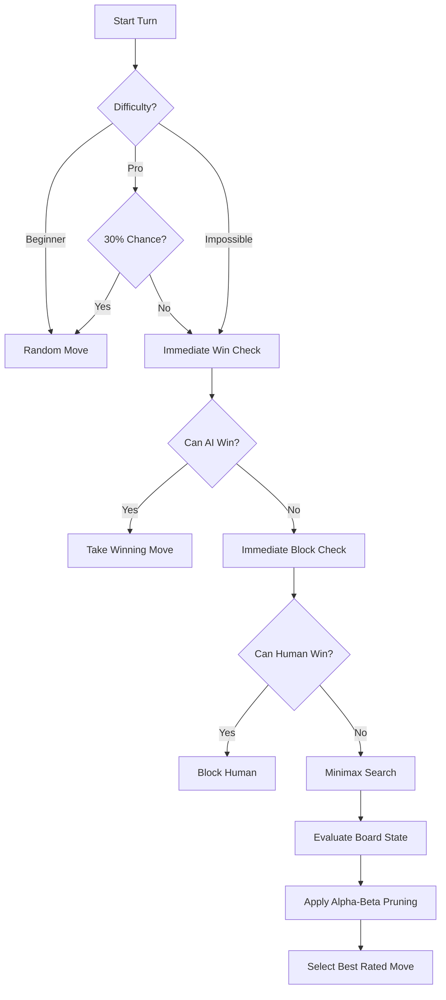

# Orbit

A sophisticated circular Tic-Tac-Toe variant built with React, TypeScript, and Vite. Orbit redefines the classic game by placing it on a 4-ring orbital grid where winning requires aligning four markers across unconventional trajectories.

**[🚀 Live Demo](https://orbit-circle-tic-tac-toe.vercel.app/)**

## 🚀 Features

- **Unique Circular Gameplay**: Play on a 4-ring board with 32 possible locations. Win by aligning 4 markers radially, circularly, or along complex spiral paths.
- **Flight Manual**: An interactive, in-game rules guide illustrating all win conditions with a focused, enlarged board view.
- **Multiplayer Modes**:
  - **SOLO**: Challenge a sophisticated AI with three difficulty levels: Beginner, Pro, and Impossible.
  - **DUO**: Local couch co-op play.
  - **ONLINE**: Real-time peer-to-peer multiplayer powered by PeerJS. "Mission Control" lobby system for hosting and joining via frequency codes.
- **Modern UI/UX**:
  - Immersive "Mission Control" interface with fluid, physics-aware transitions.
  - Seamless Dark and Light theme support with system persistence.
  - High-precision SVG-based game board with interactive animations and dashed win-path trajectories.
  - Zero layout shift architecture.

## 🤖 AI Logic (SOLO Mode)

Orbit features a multi-tiered AI that adapts to your skill level. The engine uses a combination of immediate-threat detection and state-space search to challenge players.

### Decision Workflow

The AI follows a structured priority list to determine the optimal move:



### Heuristic Engine

The AI evaluates the board using a weighted heuristic system. It analyzes all 32 possible win conditions (Radial, Circular, and Spiral) and assigns scores based on marker density:

| Alignment | AI Score | Human Score | Priority |
| :--- | :--- | :--- | :--- |
| **4 in a row** | +1,000,000 | -1,000,000 | Absolute |
| **3 in a row** | +10,000 | -15,000 | High (Defensive) |
| **2 in a row** | +500 | -500 | Medium |
| **1 in a row** | +50 | -50 | Low |

*Note: The AI prioritizes blocking a human's 3-in-a-row (-15,000) over creating its own (+10,000), resulting in a more defensive and challenging opponent.*

### Multi-threaded Architecture

To ensure a smooth 60fps experience, Orbit offloads all AI calculations to a **Web Worker**. This prevents the complex Minimax search from blocking the main UI thread, ensuring that orbital animations and interactions remain fluid even when the AI is processing deep decision trees on "Impossible" difficulty.

## 🛠️ Technical Stack

- **React 19** & **TypeScript**: For robust state management and type-safe game logic.
- **Tailwind CSS**: Precision styling using the OKLCH color system for better perceptual uniformity.
- **Web Workers**: For backgrounding heavy CPU tasks (AI) to maintain UI responsiveness.
- **PeerJS**: For decentralized, real-time WebRTC connectivity.
- **Vite**: Ultra-fast development environment and optimized production builds.
- **Vercel**: Automated CI/CD and global edge hosting.

## 🛠️ Installation

```powershell
# Install dependencies
npm install

# Start development server
npm run dev
```

## 🎮 How to Play

1. **Select Mode**: Choose between SOLO, DUO, or ONLINE in the top navigation.
2. **Consult the Manual**: Click the **?** icon in the header to view the **Flight Manual**, which visualizes all winning alignments.
3. **Win Conditions**:
   - **Radial**: 4 markers aligned from the center to the edge.
   - **Circular**: 4 markers along the same concentric ring.
   - **Spiral**: 4 markers moving across rings and slices in a clockwise or counter-clockwise curve.
4. **Victory**: The system automatically detects and highlights the winning trajectory with an animated orbital path.

---
*Built with precision for the next generation of strategy.*
